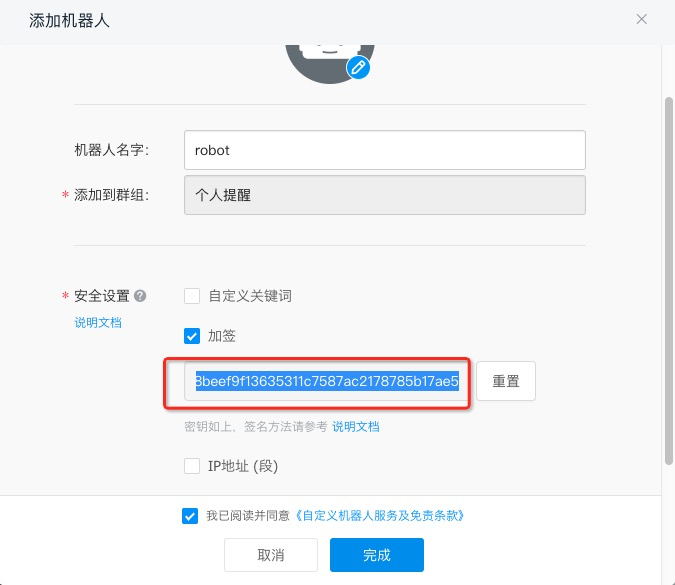

## description:

`provision-scheduler` can help you to [provision function instances](https://help.aliyun.com/document_detail/138103.html) automatically.

## usage:

* Update function info in `template.yml`
  * fields: array of functions to provision
    * `serviceName`: service name of the function to set
    * `qualifier`: qualifier of the function to set
    * `functionName`: function name to set
    * `target`: target instance count to provision
* Update `CronExpression` in `template.yml` to customize your provision scheduler
  * see [CronExpression](https://help.aliyun.com/document_detail/68172.html#h2-u5B9Au65F6u89E6u53D1u5668u914Du7F6E2) to get more informations.
  * two or more timer trigger can be set under `Events` field in `template.yml`
* Set dingtalk robot notification on provisioning function instances
  * get dingtalk robot token in App dingtalk
  * replace `dummy-dingtalk-robot-token` for ENV variable `DINGTALK_ROBOT_TOKEN` in `template.yml`

* Deploy:
  * run command `fun deploy`

## links

* [provision](https://help.aliyun.com/document_detail/138103.html)
* [funcraft](https://github.com/alibaba/funcraft)
* [specs for template.yml](https://github.com/alibaba/funcraft/blob/master/docs/specs/2018-04-03-zh-cn.md#aliyunserverlessservice)
* [CronExpression](https://help.aliyun.com/document_detail/68172.html#h2-u5B9Au65F6u89E6u53D1u5668u914Du7F6E2)
